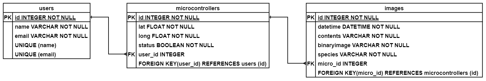

# Insect Detection API

## Install Dependencies
```python
/path/to/project pip install -r requirements.txt
```
---
## Run API
```python
/path/to/project uvicorn main:app --reload
```
> Go to http://127.0.0.1:8000/docs or http://127.0.0.1:8000/redoc

---
## Database structure


---
## API routes
---
### **POST**
|route|description|
|-------|------------|
|/user/add/|create user|
|/microcontroller/add/|create microcontroller|
|/image/add/|create image|

### **GET**
|route|description|
|----|----|
|/user/{user_id}/|read user|
|/users/|read users|
|/user/microcontroller/{micro_id}/|read user by microcontroller|
|/microcontroller/{micro_id}/|read microcontroller|
|/microcontrollers/|read microcontrollers|
|/microcontrollers/user/{user_id}/|read microcontrollers by user|
|/image/{image_id}/|read image|
|/images/|read images|
|/images/microcontroller/{micro_id}/|read images by microcontroller|

### **PATCH**
|route|description|
|-|-|
|/user/update/{user_id}/|update user|
|/microcontroller/update_status/{micro_id}/|update microcontroller status|
|/microcontroller/update/{micro_id}/|update microcontroller|

### **DELETE**
|route|description|
|-|-|
|/user/delete/{user_id}/|delete user|
|/users/delete/|delete all users|
|/microcontroller/delete/{micro_id}/|delete microcontrollers|
|/microcontrollers/delete/{user_id}/|delete microcontrollers by user|
|/microcontrollers/delete/|delete all microcontrollers|
|/image/delete/{image_id}/|delete image|
|/images/delete/{micro_id}/|delete all images by microcontroller|
|/images/delete/|delete all images|

---
## API deployment
---

> The api was distributed via [Deta Cloud](https://www.deta.sh/) and can be viewed at https://djdkdw.deta.dev/docs. For documentation refer to https://docs.deta.sh/docs/micros/about and https://fastapi.tiangolo.com/deployment/deta/

At this point, in order to request resources from the database, simply use the URL: https://djdkdw.deta.dev/ + one of the various routes

