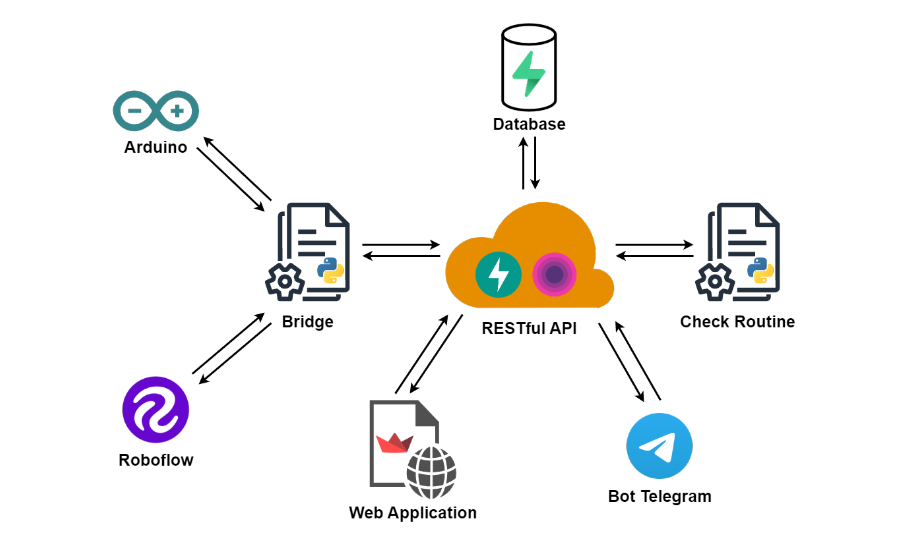

# Insect detection IoT system for Agriculture

This project provides an automated system for insect detection in agricultural environments using low-cost, low-power data collection devices. It uses an artificial intelligence model to classify pest types, and the results are distributed in the cloud to be shared and accessible to users. The work was developed as part of the "IOT and 3D Intelligent Systems" examination at the University of Modena and Reggio Emilia.

---

## Table of contents

- [Scenario](#Scenario)
- [Goal](#Goal)
- [Infrastructure](#Infrastructure)
    - [Arduino, Sensors, and Actuation](./arduino/README.md)
    - [Bridge](./inference/README.md#bridge---hardware-interconnection-module--digital-twin-in-cloud)
    - [Object Detection Model](./inference/README.md#insect-detection-model)
    - [Database](./restful_api/README.md#database)
    - [RESTful API](./restful_api/README.md#api)
    - [Web Application](./web_app/README.md)
    - [Check Routine](./check_routine/README.md)
    - [Telegram Bot](./bot_telegram/README.md)
- [Presentation](#presentation)
- [Todo](#Todo)
- [Aknowledgements](#Aknowledgements)
- [License](#License)

---

## Scenario

> **_Link:_** https://www.science.org/doi/epdf/10.1126/science.aat3466

---

## Goal

- Automate **insect identification in agricultural environments** using inexpensive and energy-efficient edge devices for data collection and implementation of control measures. 
- Use an **artificial intelligence system** to classify pest types. 
- **Deploy the results obtained in the cloud** for sharing and accessibility by users.

---

## Prototype

---

## Infrastructure

The system is composed of several modules that interact with each other to achieve the goal. The following diagram shows the architecture of the system.

- ### [Arduino, Sensors, and Actuation](./arduino/README.md)
- ### [Bridge](./inference/README.md#bridge---hardware-interconnection-module--digital-twin-in-cloud)
- ### [Object Detection Model](./inference/README.md#insect-detection-model)
- ### [Database](./restful_api/README.md#database)
- ### [RESTful API](./restful_api/README.md#api)
- ### [Web Application](./web_app/README.md)
- ### [Check Routine](./check_routine/README.md)
- ### [Telegram Bot](./bot_telegram/README.md)

---

## Presentation

> **_Link:_** https://tome.app/cileb/insect-detection-iot-system-for-agriculture-clk8hfau306j3mq3cx666xhx2
---

## Todo

- [] Improve the scalability of the system. Change the file format used to save images (base64) in the database.
- [] Use a more efficient alternative web framework to Streamlit
- [] Train a proprietary object detection model and implement inference on alternative server (not roboflow)
- [] Integrate inference within the API
- [] Simulate real system operation with pheromone traps
- [] Improve the security of the entire infrastructure

---

## Aknowledgements

|AUTHORs|CONTACTs|GITHUBs|
|-|-|-|
|Olmo Baldoni|[325524@studenti.unimore.it](mailto:325524@studenti.unimore.it)|[olmobaldoni](https://github.com/olmobaldoni)|
|Cristian Bellucci|[322906@studenti.unimore.it](mailto:322906@studenti.unimore.it)|[cleb98](https://github.com/cleb98)|
|Riccardo Santi|[212017@studenti.unimore.it](mailto:212017@studenti.unimore.it)|[RiccardoSanti092](https://github.com/RiccardoSanti092)|

---

## License

MIT
