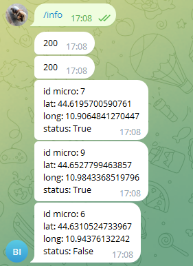
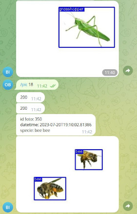
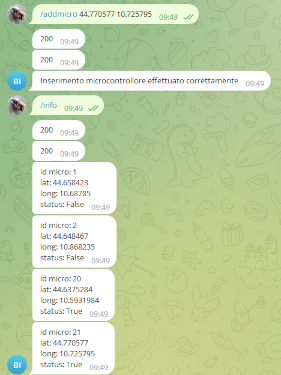

# Telegram Bot

The **[Telegram Bot](https://core.telegram.org/bots)** can perform various operations, including user creation, chat ID creation, microcontroller information retrieval, new microcontroller creation, image retrieval from a specific microcontroller, and state updating of a microcontroller.

## Bot Commands

| Command | Description |
| ----------- | ----------- |
| `/help` | Display a list of available commands. |
| `/create {name} {email}` | Create a user directly within the Telegram bot. A new user is added to the database with an assigned chat_id. |
| `/chatid {name} {email}` | Given the credentials of an existing user, create a chat_id to use the Telegram bot. |
| `/info` | Download information related to a microcontroller that you own. |
| `/addmicro {latitude} {longitude}` | Create a new microcontroller associated with a user. Given the coordinates of the microcontroller, these are associated with the microcontroller that will be added to the database. |
| `/pic {id_micro}` | Download images taken by a microcontroller, given its unique id. |
| `/statup {id_micro} {state}` | Update the status of a microcontroller (from safe to unsafe, or vice versa). |
| `{coordinates}` | Given a pair of latitude and longitude coordinates, a check is performed using k-nearest neighbors (knn) on nearby microcontrollers to verify the presence of potential infestations. |

## Database Polling

The bot continuously polls the database for updates. If one of the user-associated microcontrollers detects a potential infestation, the bot will notify the user.

## Examples

| `/info` | `/pic {id_micro}` | `/addmicro {latitude} {longitude}` |
|:-------:|:-----------------:|:----------------------------------:|
|  |  |  |
