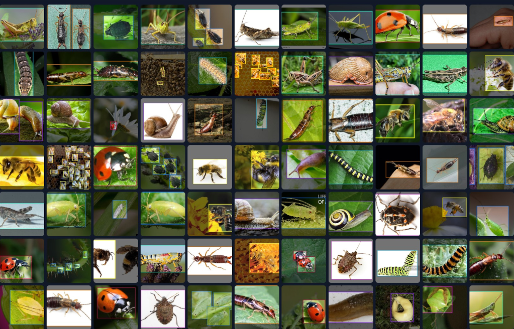
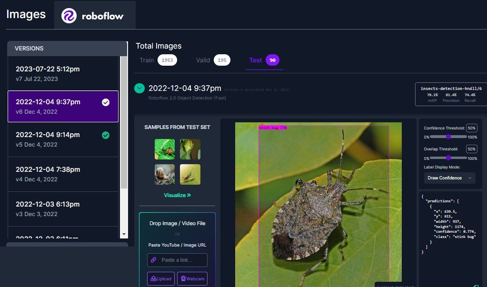

# Bridge - Hardware Interconnection Module & Digital Twin in Cloud

The **Bridge** is an interconnection module between hardware and software that acts as a **digital twin** in the cloud. It is designed to process data collected by sensors, automate the capturing of photographs, interact with the intelligent insect recognition model, notify the boards in infested areas to activate actuation, and send information to the cloud for sharing.

## Features
- **Data Processing**
- **Photograph Automation**
- **Interaction with the Insect Detection Model**
- **Notification and Activation**
- **Cloud Communication**
### Bridge Implementation
The bridge communicates with the microcontroller to obtain its status using a GET HTTP request. It establishes a serial connection and upon receiving a packet from Arduino, it calls the photo capture module and the intelligent recognition model. Detection data is saved in JSON format and sent to the database via a POST request.

---

# Insect Detection Model

The intelligent insect detection model is a non-proprietary object detection model provided by **[Roboflow Framework](https://roboflow.com/)**. It is equipped to distinguish eight species of insects common in agricultural contexts: aphid, bee, caterpillar, earwig, grasshopper, ladybug, snail, and stink bug.

## Tools Used
- **Roboflow Framework**: Used for object detection.
- **Dataset**: Consists of approximately 2000 images for insect detection.
- **Model Training**: Auto training of models present on Roboflow.

## Examples


| `Some images from the dataset` | `Annotation tool` |
|:-------:|:-----------------:|
|  |  |

### Roboflow API
The Roboflow API allows for local inference on the Roboflow model, making it a powerful tool for real-time insect detection.

## Install Dependencies

```console
smart-agri-iot-system/inference_iot pip install -r requirements.txt
```

## Run
```console
smart-agri-iot-system/inference_iot python bridge.py
```