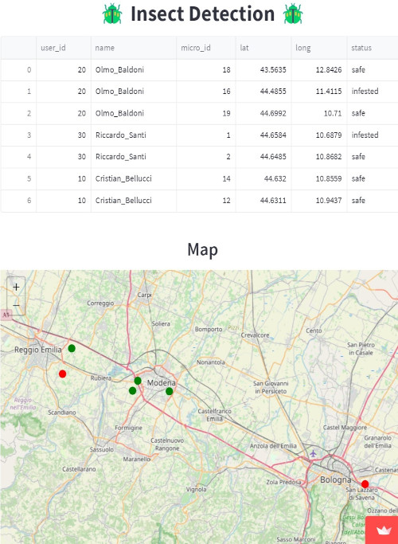
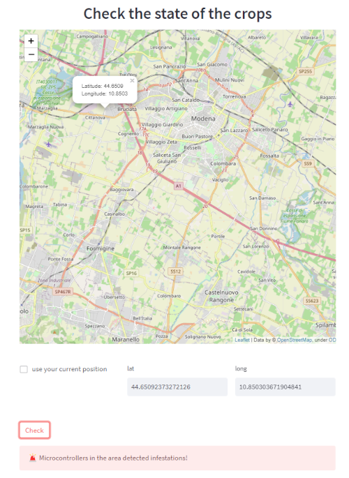
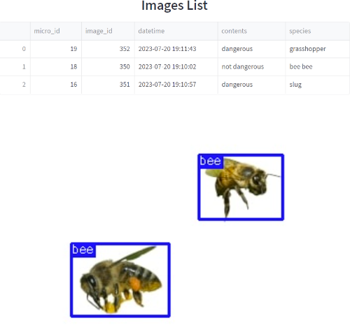

# Web Application

This web application was developed for agricultural pest monitoring using IoT sensor nodes and machine learning algorithms. It allows users to visualize sensor data over a territory, detect the presence of pests near a location, and manage their own sensor nodes.

## Tools Used

For the visualization part, **[Streamlit](https://streamlit.io/)** was chosen, an open source framework for creating Web applications in Python that allows the creation of interactive and dynamic user interfaces that can run locally or in the cloud.

## Home Page

- Dashboard showing an interactive map and list of all microcontrollers in the territory. Includes:
    - *User ID*
    - *User name*  
    - *Micro ID*
    - *Latitude/Longitude*
    - *Status*

- Ability to register a new user.
- The user can check the status of an area without a microcontroller (selected from the map or current GPS coordinates) based on nearby microcontrollers within a 10-km radius using the K-Nearest Neighbors algorithm (Haversine distance).
- It returns an error message if an infestation is detected, or a success message if none is found.

## User Page 

- Dashboard showing an interactive map and list of microcontrollers owned by a specific user. Ability to add a microcontroller via map or current GPS, and delete owned microcontrollers.
- Shows slideshow of images captured by owned microcontrollers including:
    - *Micro ID*
    - *Image ID*
    - *Datetime*  
    - *Contents*
    - *Species*

## Install Dependencies

```console
insect-detection-iot-system/web_app pip install -r requirements.txt
```

## Run

```console
insect-detection-iot-system/web_app streamlit run 🏠_Home.py
```

## Examples

| `Home` | `Knn` | `User` |
|:-------:|:-----------------:|:----------------------------------:|
|  |  |  |
